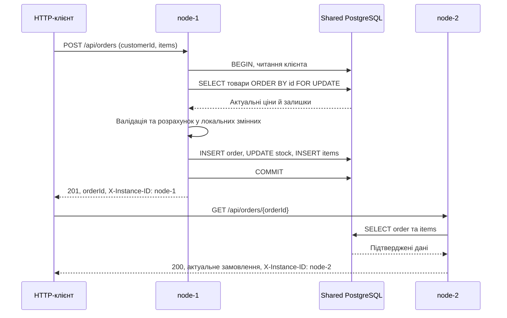
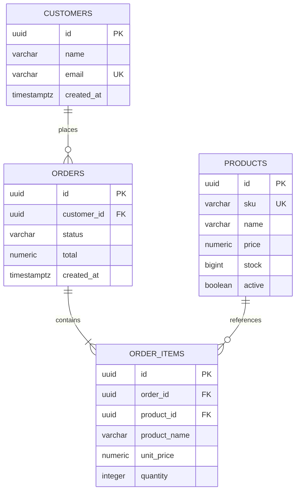
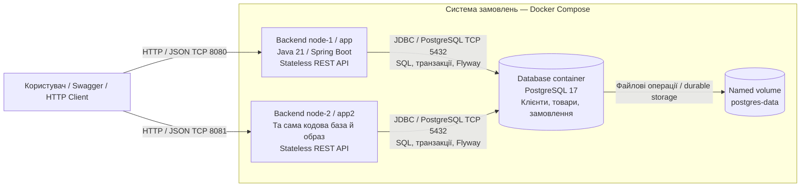
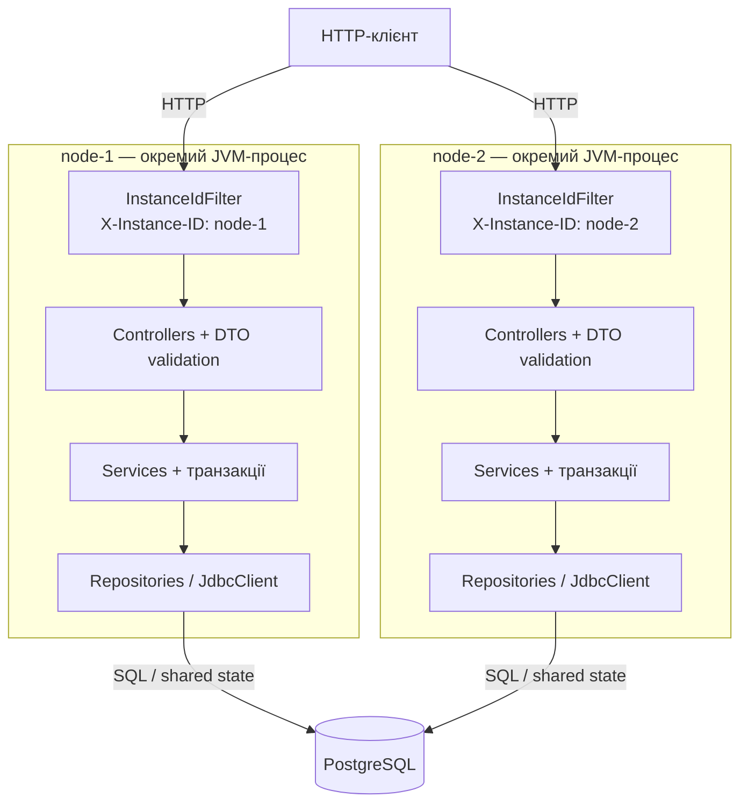

# Система замовлень для лабораторних робіт №1–2

Java-проєкт для роботи «Проєктування архітектури та реалізація базового прототипу». Система керує клієнтами, каталогом і замовленнями: перевіряє залишки, обчислює вартість, атомарно списує товари та повертає їх при скасуванні. Дані зберігаються в PostgreSQL і переживають перезапуск контейнерів.

Гілка `stateless` додає лабораторну №2: два взаємозамінні backend-процеси зі спільною PostgreSQL, ідентифікацію через `X-Instance-ID`, аудит стану та сценарії перевірки консистентності й втрати вузла. Реалізація другої лабораторної **не запускалася і не тестувалася під час підготовки змін на прохання користувача**; команди перевірки наведено нижче.

Стек: **Java 21, Spring Boot 3.5.15, Spring JDBC, PostgreSQL 17.4, Flyway, Maven 3.9.9, Docker Compose, OpenAPI/Swagger UI**. Це модульний моноліт із REST API. Бізнес-дані не зберігаються в пам'яті процесу. Усі суми — в гривнях (UAH).

## Швидкий запуск

Потрібні Docker Engine / Docker Desktop у режимі Linux containers і Docker Compose v2 із підтримкою `--wait`. Для цього способу Java та Maven на хості не потрібні. Перший запуск завантажує образи й залежності з інтернету.

```shell
docker compose up --build -d --wait
```

Команда збирає спільний образ `high-load-order-service:lab2`, запускає PostgreSQL та два backend-контейнери (`app`, `app2`), застосовує Flyway-міграцію і чекає готовності всіх трьох сервісів. Порожня база готова до використання; ручне створення таблиць не потрібне. `app2` використовує образ, зібраний сервісом `app`, тому на новому checkout запускайте весь стек із `--build`.

| Вузол | Swagger UI | Перевірка готовності | Заголовок відповіді |
|---|---|---|---|
| `app` | <http://localhost:8080/swagger-ui/index.html> | <http://localhost:8080/actuator/health> | `X-Instance-ID: node-1` |
| `app2` | <http://localhost:8081/swagger-ui/index.html> | <http://localhost:8081/actuator/health> | `X-Instance-ID: node-2` |

OpenAPI JSON: `/v3/api-docs` на кожному вузлі. Ім'я Compose-проєкту `high-load-lab1` збережено навмисно: використовується той самий volume `high-load-lab1_postgres-data`, що й у першій лабораторній. Після переходу з попередньої гілки ця команда оновить `app`, додасть `app2` і збереже дані БД.

```shell
docker compose ps
docker compose logs -f app app2
docker compose stop
docker compose start
```

Якщо порти зайняті, скопіюйте `.env.example` у `.env` і змініть `APP_PORT` та/або `APP2_PORT`. Для стандартного запуску `.env` не потрібен. PostgreSQL у базовій конфігурації не публікує порт на хості. HTTP прив'язаний до `127.0.0.1`. Пароль за замовчуванням призначений для локальної лабораторної; автентифікація та публічне розгортання не входять у цей MVP.

## Лабораторна №2 — перевірка та захист

Після запуску Compose, у PowerShell із кореня проєкту:

```powershell
# Перевірка обох вузлів без зупинки контейнерів
.\scripts\demo-stateless.ps1

# Додатково: SIGKILL першого backend, робота через другий, запуск першого знову
.\scripts\demo-stateless.ps1 -SimulateFailure
```

Якщо порти змінено:

```powershell
.\scripts\demo-stateless.ps1 -Node1Url http://localhost:8090 -Node2Url http://localhost:8091 -SimulateFailure
```

Скрипт не збирає і не запускає стек за вас. Він перевіряє `X-Instance-ID` у кожній відповіді, відсутність `Set-Cookie`, правильні HTTP-статуси та бізнес-значення. Нові демонстраційні клієнт, товар і замовлення мають унікальні email/SKU й залишаються в БД. З `-SimulateFailure` він зупиняє лише `app` і відновлює його в `finally`; PostgreSQL та `app2` не перезапускаються.

Сценарій демонстрації:

1. `POST` клієнта й товару на `node-1`, читання на `node-2`.
2. `PUT` нової ціни на `node-2`, читання оновленого товару на `node-1`.
3. Оформлення замовлення на `node-1`, читання його суми та списаного залишку на `node-2`.
4. Після успішного створення замовлення: `docker compose kill -s SIGKILL app`.
5. `node-2` читає підтверджене замовлення і продовжує бізнес-сценарій — скасовує його та повертає товар.
6. `docker compose start app`; після health `UP` відновлений `node-1` бачить `CANCELLED`.
7. Повторне скасування на `node-1` не повертає товар удруге; `node-2` бачить початковий залишок.

Для ручної демонстрації є [`docs/stateless.http`](docs/stateless.http) для IntelliJ HTTP Client. Найкоротша перевірка двох вузлів через cURL:

```shell
curl -i http://localhost:8080/actuator/health
curl -i http://localhost:8081/actuator/health
```

У Windows PowerShell 5 використовуйте `curl.exe`, оскільки `curl` там може бути псевдонімом іншої команди. Бізнесові cURL-запити з розділу API можна виконувати почергово на двох портах з тими самими UUID. Cookies та sticky sessions не потрібні. Балансувальника ще немає: адресу живого вузла явно вибирає клієнт; автоматична маршрутизація належить до лабораторної №3.

### Аудит стану

| Категорія | Об'єкт / місце в коді | Висновок і поводження при втраті JVM |
|---|---|---|
| Shared / Externalized | `customers`, `products`, `orders`, `order_items`; усі `*Repository` | Увесь бізнес-стан у спільній PostgreSQL. Кожен вузол читає ті самі підтверджені записи |
| Shared / Externalized | Залишки й ціни, статуси замовлень | У БД, захищені транзакціями та обмеженнями; немає локальних копій між запитами |
| Shared / Externalized | Узгодження конкурентних операцій | PostgreSQL `FOR UPDATE`, однаковий порядок блокування товарів. Блокування діють між різними JVM |
| Ephemeral / Local Safe | `quantities`, `lockedProducts`, `items`, `total` у `OrderService.create` | Локальні змінні одного виклику; не записуються у поля singleton-сервісу, після запиту не утримують бізнес-контекст |
| Ephemeral / Local Safe | DTO, `PageResponse`, результати SQL | Об'єкти конкретного запиту/відповіді; не є джерелом стану для наступних запитів |
| Ephemeral / Local Safe | HikariCP, ресурси JDBC, транзакційний контекст Spring | Інфраструктура процесу. Пули відтворюються при запуску; незавершені транзакції БД відкотить після втрати з'єднань |
| Ephemeral / Local Safe | `static final RowMapper`, logger, константи, посилання на залежності у сервісах | Незмінна конфігурація та інфраструктура, а не змінний бізнес-стан |
| Ephemeral / Local Safe | `InstanceIdFilter.instanceId` | Незмінна діагностична мітка; не використовується для пошуку даних чи прив'язки клієнта |
| Ephemeral / Local Safe | Логи stdout, локальні метрики JVM, `/tmp` | Діагностика та тимчасові файли. Backend має read-only filesystem із тимчасовим `/tmp`, без volume для бізнес-даних |
| Critical Stateful Dependencies | `HttpSession`, файлові сесії, `@SessionAttributes`, sticky sessions | У базовому коді не виявлено; API не створює сесій. `customerId`/інші UUID передаються явно в запиті |
| Critical Stateful Dependencies | Singleton/static collections, локальні кеші, бізнес-лічильники, `synchronized`/JVM locks | У базовому коді не виявлено. Колекції в методах не є сховищем між запитами; ID — UUID, перевірка унікальності — в БД |

**Результат рефакторингу:** перша лабораторна вже винесла бізнес-стан у PostgreSQL, тому критичних in-memory залежностей для вилучення не знайдено. У цій гілці додано multi-instance розгортання, діагностичний фільтр, окремі ідентифікатори JDBC-з'єднань для спостереження в `pg_stat_activity`, перевірки взаємозамінності й документацію. Бізнес-операції не потребують штучного переписування. Сесійного стану немає, тому додавати Redis/сесії лише заради їх винесення не потрібно: shared storage тут — Primary DB, що дозволено умовою лабораторної.

### Stateless Request Flow

Контекст оформлення повністю міститься у `POST /api/orders`: `customerId` і список `productId/quantity`. Сервер не бере ціни або залишки з клієнта чи з пам'яті попередніх запитів.



Після запиту бізнес-контекст не утримується полями singleton-компонентів. В обох процесах однакові код, схема даних і правила транзакцій; відрізняються лише порт на хості та діагностична мітка. `INSTANCE_ID` задається конфігурацією, за його відсутності використовується `HOSTNAME`, а поза контейнером без обох значень — згенерований на час життя фільтра UUID. Вхідний `X-Instance-ID` ігнорується: клієнт не може підмінити мітку відповіді.

### Гарантії та перевірка аварії

- Отриманий `201` означає, що транзакція вже закомічена; зупинка одного backend не видаляє це замовлення.
- Падіння до commit не повинно залишати частково створене замовлення чи частково списаний склад: PostgreSQL відкотить транзакцію після розриву з'єднання. Звільнення блокувань може потребувати часу на виявлення розриву.
- Якщо commit відбувся, але клієнт не отримав відповідь, результат запиту для клієнта невідомий. Створення замовлення поки не має idempotency key, тому автоматично повторювати такий POST небезпечно.
- Зупинений вузол не переносить активний HTTP-запит на інший процес. Другий вузол продовжує **наступні** операції зі спільним станом. Розрив з'єднання з убитим вузлом очікуваний, це не втрата підтверджених даних.

`demo-stateless.ps1 -SimulateFailure` демонструє збій **між кроками бізнес-сценарію**, після підтвердженого створення замовлення. Окремий `StatelessClusterIT` перевіряє SIGKILL **усередині незавершеної транзакції**: у тимчасовій тестовій БД ставить advisory lock і trigger перед вставкою позиції, чекає його в `pg_stat_activity`, вбиває першу JVM після запису замовлення та зміни складу, перевіряє rollback і нове оформлення на другій JVM. Цей trigger не входить у Flyway-міграції або звичайний Compose-стек.

### Покриття вимог другої лабораторної

| Пункт | Результат |
|---|---|
| 2.1 Аудит стану | Класифікація Ephemeral / Shared / Critical у таблиці вище |
| 2.2 Винесення стану | Уся персистентна бізнес-інформація та блокування у спільній PostgreSQL; сесій немає |
| 2.3 Stateless Request Flow | Параметри, shared reads, атомарні записи, commit, читання іншим вузлом |
| 2.4 Два instances та ідентифікація | `app` + `app2`, однаковий Docker image, `X-Instance-ID` |
| 2.5 Consistency / instance loss | PowerShell/HTTP сценарії та інтеграційні тести двох окремих JVM |
| 2.6 Архітектурна документація | Оновлені container/component схеми нижче |

## Демонстрація першої лабораторної

У PowerShell із кореня проєкту:

```powershell
.\scripts\demo.ps1 -VerifyPersistence
```

Скрипт створює клієнта й товар з унікальними значеннями, читає каталог, змінює ціну, оформлює замовлення, перевіряє списання та суму, **перезапускає контейнер БД**, повторно читає замовлення, двічі скасовує його і перевіряє одноразове повернення залишків. На завершення прибирає товар із каталогу та перевіряє збереження історії. Помилка перевірки завершує скрипт винятком. Створені демонстраційні дані залишаються в БД.

Для власного порту:

```powershell
.\scripts\demo.ps1 -BaseUrl http://localhost:8081 -VerifyPersistence
```

Без автоматичного перезапуску БД використовуйте `.\scripts\demo.ps1`. Інтерактивні приклади для IntelliJ IDEA знаходяться в [`docs/api.http`](docs/api.http). Також усі endpoints доступні через Swagger `Try it out`.

План захисту:

1. Показати холодну збірку та запуск командою `docker compose up --build -d --wait` на новому checkout.
2. Відкрити Swagger і пояснити зв'язки сутностей на ER-діаграмі нижче.
3. Продемонструвати щонайменше п'ять endpoints через Swagger, HTTP Client або `demo.ps1`.
4. Показати `409` при нестачі товару і `400` при невалідній кількості.
5. Перезапустити БД та прочитати те саме замовлення за його ID.
6. Пояснити транзакцію оформлення, порядок блокувань і потенційні bottlenecks.

## Покриття вимог першої лабораторної

| Вимога | Реалізація |
|---|---|
| Мінімум 3 інтегровані сутності | Customer, Product, Order, OrderItem; зовнішні ключі в PostgreSQL |
| Мінімум 5 бізнесових endpoints | 12 REST endpoints: клієнти, каталог, замовлення |
| CRUD і бізнес-логіка | CRUD товарів, поповнення, атомарне оформлення та скасування замовлень |
| Валідація та обробка помилок | Jakarta Validation, обмеження БД, Problem Details, HTTP 400/404/409/503 |
| Постійне сховище | PostgreSQL, named volume `postgres-data`, без in-memory БД |
| Міграції | `src/main/resources/db/migration/V1__create_order_schema.sql`, Flyway при запуску |
| Запуск однією командою | `compose.yaml`, multi-stage `Dockerfile`, health checks, окрема Docker network |
| Архітектурна схема й опис API | Діаграми нижче, таблиця endpoints, `/v3/api-docs`, Swagger |
| High-load сценарій | Одночасне оформлення замовлень на обмежений залишок популярних товарів |
| Мінімум 3 вузькі місця | П'ять розібраних ризиків у таблиці нижче |
| Розподіл відповідальності | Таблиця модулів наприкінці README |

## Доменна модель



- **Customer**: ім'я та унікальна email-адреса; email нормалізується до нижнього регістру.
- **Product**: унікальний SKU у верхньому регістрі, опис, ціна, залишок та ознака доступності.
- **Order**: замовлення одного клієнта, статус `PLACED` або `CANCELLED`, загальна вартість і час.
- **OrderItem**: товар, кількість, зафіксовані назва й ціна на момент оформлення. Зміни каталогу не змінюють історію.

Обмеження: 1–50 різних товарів у замовленні, 1–10000 одиниць кожного товару; повторення одного товару в запиті заборонено. Ціна додатна, максимум 10 цифр до коми та 2 після; розрахунок через `BigDecimal` і PostgreSQL `NUMERIC`. Початковий залишок 0–1 000 000 000; одне поповнення 1–1 000 000 000. У БД залишок має тип `BIGINT` і не може бути від'ємним.

## Архітектура

Схема контейнерів у стилі C4 показує межу системи, протоколи та напрямки запитів:



Компонентна схема двох процесів; у кожному працюють ті самі controller → service → repository:



Модульний моноліт достатній для поточного домену: дозволяє оформити замовлення і списати залишки однією транзакцією БД. Пакети розділені за предметними модулями, всередині яких є controller → service → repository. JDBC обраний для явних SQL-запитів і блокувань; ORM та прихованого lazy loading немає. Зовнішніх інтеграцій і черг у першій лабораторній немає.

### Транзакція оформлення

1. Перевірити клієнта та унікальність позицій запиту.
2. Одним `SELECT ... WHERE id IN (...) ORDER BY id FOR UPDATE` заблокувати потрібні товари в узгодженому порядку.
3. Перевірити існування, доступність і залишки всіх товарів.
4. Розрахувати суму за актуальними цінами БД, створити замовлення, списати залишки й записати позиції.
5. Зробити commit; при помилці відкотити всі зміни через `@Transactional`.

Конкурентний покупець чекає блокування та після його отримання бачить актуальний залишок. Оновлення товару й поповнення використовують ті самі блокування. Для скасування спочатку блокується замовлення, потім товари в тому самому порядку; повторне скасування вже `CANCELLED` не повертає товар вдруге. Блокування реалізовані в PostgreSQL, а не через `synchronized` у JVM.

POST створення замовлення не має idempotency key: повторно надісланий успішний запит створить інше замовлення. Якщо клієнт втратив відповідь після commit, автоматичний повтор не гарантує відсутності дубля. Це задокументоване обмеження MVP. Скасування за конкретним ID повторювати безпечно.

## Специфікація API

Базовий шлях `/api`. Формат запитів і відповідей — JSON. Успішний POST створення повертає `201 Created` та заголовок `Location`.

Відповіді API, включно з валідаційними помилками, містять `X-Instance-ID`. Цей заголовок є діагностичним; його не потрібно зберігати або надсилати для наступного запиту. Контракт бізнесових endpoints першої лабораторної збережений.

| Метод | Шлях | Операція | Успіх |
|---|---|---|---|
| POST | `/api/customers` | Створити клієнта | 201 |
| GET | `/api/customers/{id}` | Прочитати клієнта | 200 |
| POST | `/api/products` | Створити товар | 201 |
| GET | `/api/products?page=0&size=20` | Каталог активних товарів | 200 |
| GET | `/api/products/{id}` | Прочитати товар | 200 |
| PUT | `/api/products/{id}` | Замінити редаговані поля: назву, опис, ціну | 200 |
| DELETE | `/api/products/{id}` | Деактивувати товар | 204 |
| POST | `/api/products/{id}/restock` | Поповнити залишок | 200 |
| POST | `/api/orders` | Оформити замовлення | 201 |
| GET | `/api/orders/{id}` | Замовлення з позиціями | 200 |
| GET | `/api/orders?customerId={id}&page=0&size=20` | Історія замовлень клієнта | 200 |
| POST | `/api/orders/{id}/cancel` | Скасувати замовлення | 200 |

`DELETE` є логічним видаленням: товар зникає з каталогу, GET товару повертає 404, нове замовлення на нього відхиляється, але посилання та історія залишаються. Повторний DELETE існуючого деактивованого товару повертає 204. SKU залишається зарезервованим. PUT не змінює SKU або залишок; для залишку є окрема бізнес-операція.

Списки мають форму `{"items": [], "page": 0, "size": 20, "hasNext": false}`. Межі: `page` 0–10000, `size` 1–100. Виконується вибірка `size + 1` рядків без дорогого `COUNT(*)`. Порядок — час створення за спаданням, потім UUID; offset-пагінація не гарантує незмінності сторінок при конкурентних вставках.

### Приклади cURL

Наведений синтаксис — для Bash; у Windows використовуйте `demo.ps1`, IntelliJ HTTP Client або Swagger. Після перших двох запитів підставте отримані UUID замість `CUSTOMER_ID` і `PRODUCT_ID`.

```bash
curl -i -X POST http://localhost:8080/api/customers \
  -H 'Content-Type: application/json' \
  -d '{"name":"Olena","email":"olena@example.com"}'

curl -i -X POST http://localhost:8080/api/products \
  -H 'Content-Type: application/json' \
  -d '{"sku":"BOOK-001","name":"System Design","description":"Book","price":800.00,"stock":10}'

curl 'http://localhost:8080/api/products?page=0&size=20'

curl -i -X POST http://localhost:8080/api/orders \
  -H 'Content-Type: application/json' \
  -d '{"customerId":"CUSTOMER_ID","items":[{"productId":"PRODUCT_ID","quantity":2}]}'

curl http://localhost:8080/api/orders/ORDER_ID
curl -X POST http://localhost:8080/api/orders/ORDER_ID/cancel
```

### Помилки

| Код | Приклади |
|---|---|
| 400 | Невалідний JSON/UUID/email, порожнє замовлення, від'ємна чи дробова кількість, дубль позиції, невідоме поле |
| 404 | Відсутній клієнт/товар/замовлення; деактивований товар при GET |
| 409 | Зайнятий email/SKU, недостатній залишок, оформлення деактивованого товару, порушення обмежень даних |
| 503 | Таймаут блокування, недоступна операція JDBC або перевантаження БД |

Приклад `application/problem+json`:

```json
{
  "type": "about:blank",
  "title": "Conflict",
  "status": 409,
  "detail": "Insufficient stock for product: BOOK-001",
  "instance": "/api/orders"
}
```

Помилки Bean Validation додатково містять масив `errors` із `field` та `message`. Внутрішній SQL не включається у відповіді API.

## Збереження даних

Flyway створює схему та індекси. Ключі UUID, зовнішні ключі, `UNIQUE` і `CHECK` захищають цілісність на рівні БД. Складені індекси підтримують каталог та історію замовлень, індекс унікальності позицій — пошук позицій замовлення. Файли PostgreSQL знаходяться в named volume, окремому від контейнера.

```shell
docker compose restart db
docker compose ps
```

Після відновлення `health` той самий GET замовлення повертає збережені дані. Під час самого перезапуску є коротка недоступність: цей прототип має одну БД і не обіцяє high availability. `docker compose down` залишає named volume; **`docker compose down -v` видаляє дані**, тому для перевірки persistence його не використовуйте. Зміна `DB_PASSWORD` у `.env` не змінює пароль уже ініціалізованої БД.

## High-load сценарій

Пікова ситуація — старт розпродажу: багато клієнтів одночасно викликають `POST /api/orders`, купуючи 1–50 позицій, зокрема один популярний товар з обмеженим запасом. Це навантажує запис у БД, WAL, пул з'єднань і row-level locks. До одного замовлення входять читання клієнта, блокування товарів, запис замовлення та по одному оновленню залишку і вставці позиції на кожен товар.

Для `N` позицій поточний checkout виконує приблизно **3 + 2N SQL statements**, не враховуючи керування транзакцією. Сценарій навмисно має зрозумілу реалізацію для першої лабораторної; пакетні записи й оптимізація запитів можуть бути наступними кроками після вимірювання.

## Аналіз потенційних вузьких місць

Наведені висновки є теоретичними гіпотезами, а не результатами навантажувального тесту. Числові RPS/p99 у першій лабораторній не вигадуються.

| Компонент / операція | Причина | Очікувані симптоми та метрики | Як перевірити / напрям оптимізації |
|---|---|---|---|
| PostgreSQL, checkout популярного товару | Конкуренція за `FOR UPDATE` одного рядка; запити на цей товар серіалізуються | Зростання p95/p99, lock wait, HTTP 503 при timeout, RPS перестає зростати | `pg_stat_activity`, `pg_locks`; скоротити транзакцію, зменшити SQL round trips |
| HikariCP, увесь API | Максимум 10 з'єднань; повільні транзакції утримують пул | Очікування з'єднання, connection timeout, висока tail latency навіть простих GET | Метрики active/pending connections; спершу знайти повільні SQL, потім узгодити pool із лімітом БД |
| PostgreSQL, запис замовлень | WAL/fsync та оновлення індексів створюють I/O-навантаження | Високий disk latency/I/O wait, commit latency, плато write RPS | Метрики диска й БД; швидший диск, batch inserts, контроль кількості індексів |
| Backend ↔ DB, багатопозиційне замовлення | `3 + 2N` послідовних SQL statements усередині транзакції | Latency зростає з кількістю позицій; довше утримуються locks і connections | Порівняти 1/10/50 позицій; batch для вставок, переглянути повернення даних після UPDATE |
| Каталог, великі обсяги читань та глибокі сторінки | Кожен GET читає БД; OFFSET пропускає багато рядків | DB CPU/read I/O, дорожчі пізні сторінки, зростання p99 | `EXPLAIN (ANALYZE, BUFFERS)`; keyset pagination та кеш read-intensive запитів у наступних роботах |

У другій лабораторній backend уже має два взаємозамінні екземпляри, але PostgreSQL залишається єдиною точкою відмови. Балансувальник, автоматичне перенаправлення трафіку і Redis належать до наступних лабораторних. Кожен backend має окремий пул: з `DB_POOL_SIZE=10` два вузли можуть зайняти сумарно до 20 робочих з'єднань БД, плюс тимчасові адміністративні/міграційні з'єднання.

## Тести та локальна розробка

Для запуску поза контейнером потрібні JDK 21 та Docker. Maven завантажується через Wrapper.

```powershell
# Швидкі тести обчислень та ідентифікації вузла без Docker
.\mvnw.cmd test

# Повна збірка: попередні тести + два окремі JVM-контейнери зі спільною PostgreSQL
.\mvnw.cmd verify

# Тільки нові кластерні інтеграційні тести (з побудовою JAR)
.\mvnw.cmd verify '-Dit.test=StatelessClusterIT'
```

У Linux/macOS: `sh mvnw test` і `sh mvnw verify`. Інтеграційні тести названі `*IT` і запускаються Maven Failsafe на фазі `verify`. Docker потрібен для повної перевірки; тести не пропускаються мовчки за його відсутності. Testcontainers створює окрему тимчасову БД, не використовує дані Compose і видаляє свої контейнери після тестів.

`StatelessClusterIT` сам запускає ізольовані контейнери PostgreSQL і двох JVM на випадкових портах. Compose для нього піднімати не потрібно. Тестам потрібен інтернет для першого завантаження образів/залежностей. Вони перевіряють послідовну роботу через різні вузли, конкурентне оформлення на двох JVM, збереження commit після SIGKILL і відкат перерваної транзакції. Не запускайте лише фазу `failsafe:integration-test` на старому JAR — використовуйте `verify`, щоб перевіряти поточний код.

Перевіряються CRUD/пагінація, Location headers, валідація й коди помилок, конфлікти email/SKU, історичні ціни, транзакційний rollback після примусової помилки БД, конкурентна купівля останніх одиниць, одноразове повернення складу при конкурентних скасуваннях, Flyway, health і OpenAPI. Persistence після рестарту перевіряє `demo.ps1 -VerifyPersistence`.

Історична перевірка **першої лабораторної**, до змін цієї гілки, 02.10.2026: 14 тестів успішно; стек з одного backend і БД був healthy; `demo.ps1 -VerifyPersistence` — PASS. **Це не результат перевірки лабораторної №2.** Нові unit/cluster тести, оновлений Compose і `demo-stateless.ps1` підготовлені, але не запускалися на прохання користувача.

Локальний backend з БД у Docker:

```powershell
docker compose stop app app2
docker compose -f compose.yaml -f compose.dev.yaml up -d --wait db
.\mvnw.cmd spring-boot:run
```

Стандартний JDBC URL — `jdbc:postgresql://localhost:5432/orders`. Якщо змінено пароль або порт БД, перед запуском Java задайте `DB_URL`, `DB_USERNAME`, `DB_PASSWORD` у середовищі IDE/термінала. Spring Boot самостійно не читає `.env`, його читає Compose.

Для двох JVM поза Docker відкрийте два термінали, задайте в першому `$env:PORT='8080'; $env:INSTANCE_ID='node-1'`, у другому `$env:PORT='8081'; $env:INSTANCE_ID='node-2'` та запустіть `java -jar target/order-service-1.0.0.jar` у кожному після `mvnw.cmd package`. Обидва процеси повинні використовувати однаковий `DB_URL`. Для сценарію з `docker compose kill` використовуйте саме контейнерний запуск.

| Змінна | Типове значення | Призначення |
|---|---|---|
| `DB_URL` | `jdbc:postgresql://localhost:5432/orders` | Адреса БД; Compose використовує host `db` |
| `DB_USERNAME` | `orders` | Користувач БД |
| `DB_PASSWORD` | `lab1-local-password` | Пароль локальної БД |
| `DB_POOL_SIZE` | `10` | Ліміт з'єднань кожного екземпляра |
| `PORT` | `8080` | HTTP-порт Java-процесу |
| `APP_PORT` | `8080` | Опублікований порт Compose |
| `APP2_PORT` | `8081` | Опублікований порт другого backend |
| `INSTANCE_ID` | `node-1` / `node-2` у Compose | Діагностична ідентичність JVM, заголовок відповіді |

## Структура проєкту

```text
src/main/java/ua/edu/highload/
  OrderApplication.java
  customer/       контролер, сервіс, repository, DTO клієнта
  catalog/        каталог, редагування та складські операції
  order/          оформлення, історія і скасування замовлень
  common/         помилки API, пагінація, OpenAPI, InstanceIdFilter
src/main/resources/
  application.yaml
  db/migration/V1__create_order_schema.sql
src/test/java/ua/edu/highload/
  OrderApiIT.java
  StatelessClusterIT.java
  common/InstanceIdFilterTest.java
  order/OrderItemTest.java
docs/api.http
docs/stateless.http
scripts/demo.ps1
scripts/demo-stateless.ps1
compose.yaml
compose.dev.yaml
Dockerfile
pom.xml
mvnw / mvnw.cmd
```

## Розподіл відповідальності

Для індивідуального виконання всі модулі належать виконавцю лабораторної. Перед поданням впишіть своє ПІБ; якщо робота командна — замініть ролі фактичними іменами та реальним розподілом. Авторство інших учасників тут не припускається.

| Модуль / результат | Відповідальний при індивідуальному виконанні |
|---|---|
| Доменна модель, архітектура, аналіз bottlenecks | Виконавець лабораторної |
| Customers, catalog, API та валідація | Виконавець лабораторної |
| Замовлення, транзакції та робота зі складом | Виконавець лабораторної |
| PostgreSQL, міграції, Docker Compose | Виконавець лабораторної |
| Тести, документація та демонстрація | Виконавець лабораторної |

## Технічні джерела

- [Spring Boot 3.5 reference](https://docs.spring.io/spring-boot/3.5/reference/index.html)
- [springdoc OpenAPI для Spring Boot 3](https://springdoc.org/v2/)
- [PostgreSQL explicit locking](https://www.postgresql.org/docs/17/explicit-locking.html)

Версії Java-залежностей зафіксовані у `pom.xml` і Spring Boot BOM, Maven — у Wrapper, базові образи — тегами у Dockerfile/Compose. Теги образів не закріплені digest, тому це відтворюваний навчальний запуск, а не побітово ідентична збірка.
