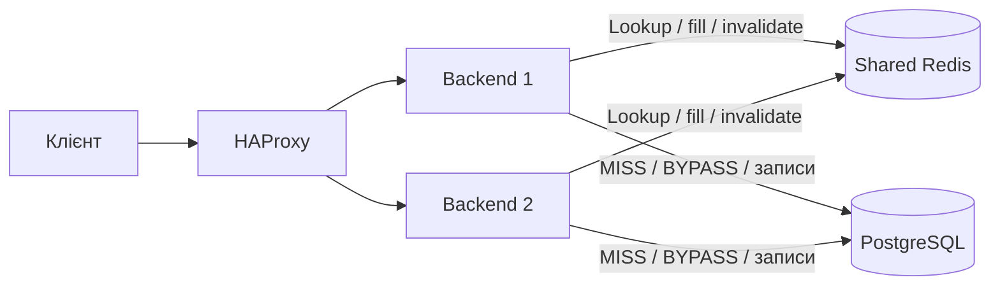
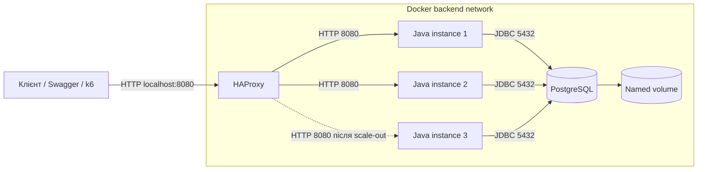

# Лабораторна №4 — розподілене кешування

До масштабованого Java API додано спільний Redis і Cache-Aside для `GET /api/products?page=...&size=...`. Бізнес-дані залишаються в PostgreSQL. Redis доступний усім backend-реплікам через внутрішню Docker network, без порту на хості.

**Код, тести й демонстрації цієї лабораторної не запускалися на прохання користувача.** Числа продуктивності потрібно отримати самостійно.

## Запуск і демонстрація кешу

```powershell
docker compose up --build -d --wait --remove-orphans
.\scripts\demo-cache.ps1
# Додатково: зупинити Redis, перевірити читання та запис через БД, відновити Redis
.\scripts\demo-cache.ps1 -SimulateFailure
```

Swagger: <http://localhost:8080/swagger-ui/index.html>. Виконуйте demo без паралельного навантаження: скрипт очікує точну послідовність MISS → HIT → PUT → MISS → HIT. Він створює новий товар, перевіряє свіжу ціну, показує `X-Instance-ID`, `X-Cache` і час кожного GET. З `-SimulateFailure` також змінює ціну при вимкненому Redis та перевіряє її через BYPASS; Redis запускається знову в `finally`. Демонстраційний товар залишається в БД.

## Що кешується і чому

Каталог — read-intensive сценарій: багато користувачів можуть читати ті самі сторінки, тоді як набір товарів змінюється рідше. Кеш зменшує кількість SELECT каталогу й повторну підготовку відповіді. Виграш для маленької локальної БД не гарантований: Redis і JSON-серіалізація теж мають вартість.

| Параметр | Значення |
|---|---|
| Endpoint | `GET /api/products`, усі валідні комбінації page/size |
| Ключ сторінки | `orders:catalog:v1:{epoch}:page:{page}:size:{size}` |
| Ключ поточного покоління | `orders:catalog:v1:epoch` |
| TTL сторінки | 30 секунд, `CACHE_TTL_SECONDS`, дозволено 1–3600 |
| Eviction | Redis `allkeys-lru`, ліміт 128 MB |
| Джерело істини | PostgreSQL |
| Вимкнення кешу | `CACHE_ENABLED=false` |

`v1` версіонує формат, epoch — випадковий UUID, а page/size повністю описують параметри поточного endpoint. Порядок сортування фіксований у SQL. При додаванні фільтрів, валют, локалі або персоналізації вони також повинні увійти до ключа. Індивідуальний GET товару та всі операції запису працюють із БД без кешу.

**HIT:** з Redis читається namespace і готова сторінка, SELECT каталогу не виконується. **MISS:** сторінка читається з PostgreSQL і записується в Redis із TTL. **BYPASS:** кеш вимкнений, недоступний або його запис/десеріалізація не вдалися — відповідь формується з БД. Значення передається заголовком `X-Cache`.

## Інвалідація та узгодженість

Створення, PUT, поповнення, видалення товару, checkout і скасування замовлення змінюють каталог або залишки. `ProductRepository` планує інвалідацію для всіх цих шляхів. У транзакції виконується одна інвалідація **після commit**, при rollback — жодної. Для автокомітної операції — після успішного SQL.

Інвалідація встановлює новий UUID у ключ epoch. Наступний GET використовує новий namespace і повертає MISS зі свіжими даними. Усі сторінки старого покоління стають недоступними й видаляються за TTL; немає дорогого `KEYS *` або сканування всього Redis. Якщо старий паралельний MISS завершиться після інвалідації, він запише сторінку у старий namespace, не перезаписуючи нові дані.

Це гарантує свіже послідовне читання після успішної інвалідації за доступного Redis. **Між commit PostgreSQL та оновленням Redis немає спільної транзакції.** Якщо вузол впаде в цьому проміжку або інвалідація не дійде до Redis через мережевий збій, інший вузол може прочитати стару сторінку до її expiration. Помилка інвалідації логується; підтверджений запис у БД не скасовується. TTL обмежує життя запису, але сам по собі не дає строгої консистентності. Для суворішої гарантії за таких збоїв потрібен окремий протокол узгодження/доставки інвалідацій і контроль версій.

Кеш не використовується для перевірки наявності товару чи обчислення ціни checkout: ці рішення завжди приймаються транзакційно в PostgreSQL. Застаріла вітрина не дозволяє продати відсутній товар.

## Fallback та відновлення

Redis — необов'язкова залежність backend: його немає в `depends_on` застосунку, а Redis health indicator виключено з загального Actuator health. `/health` і маршрутизація HAProxy залежать від PostgreSQL. При помилці Redis читання переходить у BYPASS; connect/command timeout — 200 мс. Cache SET failure не спричиняє повторного SELECT.

Redis налаштований без persistence. Після `docker compose stop redis` / `start redis` його кеш порожній, нові запити прогріють його з БД. Це властивість саме цієї конфігурації; короткий мережевий збій без рестарту не очищає пам'ять Redis. Fallback зберігає функціональність, але може різко збільшити навантаження на PostgreSQL.



## Вимірювання та перевірки

Запишіть показані скриптом elapsed ms; це одиничні HTTP-вимірювання з клієнтськими накладними витратами, не навантажувальний baseline. Повторіть кілька разів при однакових даних і порівнюйте однакові page/size.

| Режим | X-Cache | Час відповіді, мс |
|---|---|---|
| Перший GET після зміни | MISS | ще не виміряно |
| Повторний GET | HIT | ще не виміряно |
| Redis зупинений | BYPASS | ще не виміряно |

Логи інвалідацій: `docker compose logs app`. Для HIT/MISS діагностичних логів встановіть рівень DEBUG для `ua.edu.highload.catalog.CatalogCache`; у звичайному режимі достатньо заголовків. Backend може повернути HIT на іншому `X-Instance-ID`, бо кеш спільний.

Для uncached-порівняння в наступній лабораторній:

```powershell
$env:CACHE_ENABLED = 'false'
docker compose up -d --no-deps --force-recreate --wait app
# Повернути кеш
$env:CACHE_ENABLED = 'true'
docker compose up -d --no-deps --force-recreate --wait app
```

Після записів у режимі CACHE_ENABLED=false дочекайтеся повного TTL перед поверненням кешу або перезапустіть Redis, щоб не використати сторінки попереднього запуску. Усі репліки повинні мати однакове налаштування кешу. Для запуску Java з IDE кеш типово вимкнений; Compose явно вмикає його і задає `REDIS_HOST=redis`.

Додані unit-тести `CatalogCacheTest`: MISS→HIT без повторного SQL, fallback, одиничний SELECT при помилці SET, інвалідація після commit та її відсутність після rollback. Команди: `.\mvnw.cmd test` або `.\mvnw.cmd verify` (повний набір потребує Docker). Тести не запускалися.

До теоретичного захисту: expiration — завершення TTL; invalidation — примусове припинення використання даних після зміни. LRU витісняє давно не використані ключі, LFU — рідко використовувані. Cache stampede — конкурентні MISS одного ключа, avalanche — масове одночасне закінчення кешу/відмова Redis. Цей MVP не має single-flight чи distributed lock для заповнення; можливі повторні SELECT. Напрями покращення — jitter TTL, обмеження конкурентного заповнення та контроль навантаження на БД.

## Попередня лабораторна №3 — горизонтальне масштабування

Java 21 / Spring Boot API працює за HAProxy. Репліки використовують спільну PostgreSQL, повертають власний `X-Instance-ID` і не зберігають бізнес-стан локально. Типово запускаються два backend-контейнери; клієнту доступний тільки порт балансувальника.

**Зміни не запускалися і не тестувалися — за домовленістю з користувачем.** Нижче команди самостійної перевірки; виміряних результатів поки немає.

Доменна модель, 12 endpoints, транзакції та аудит стану збережені в [описі лабораторних №1–2](docs/labs1-2.md). Команди нижче збережено для масштабування. Для порівняння саме Lab 3 вимкніть кеш; профіль затримки вмикається через `SPRING_PROFILES_ACTIVE=lab3` із відтворенням backend.

## Запуск

Потрібен Docker Desktop із Linux containers і Compose v2. Java/Maven на хості потрібні лише для Java-тестів поза Docker.

```powershell
docker compose up --build -d --wait --remove-orphans
```

`--remove-orphans` прибирає старий `app2`; тепер використовуються репліки одного сервісу `app`. Ім'я проєкту `high-load-lab1` і volume PostgreSQL збережені. При переході зі старої гілки можливе коротке переривання доступу до порту 8080.

- Swagger: <http://localhost:8080/swagger-ui/index.html>
- Каталог: <http://localhost:8080/api/products>
- Readiness: <http://localhost:8080/health>
- OpenAPI: <http://localhost:8080/v3/api-docs>

`APP_PORT` у `.env` змінює публічний порт. У backend і БД немає `ports`; клієнт звертається тільки до HAProxy. `compose.dev.yaml` публікує БД для IDE, тому не застосовується для демонстрації ізоляції. Docker-адміністратор усе ще має доступ до внутрішньої мережі.

```powershell
docker compose ps
docker compose logs -f lb
docker compose stop
```

## Архітектура



[`infra/haproxy.cfg`](infra/haproxy.cfg) використовує Docker DNS `127.0.0.11` та 10 слотів `server-template`. Репліки знаходяться без ручного внесення IP. `X-Instance-ID` — hostname контейнера; після відтворення він може змінитися.

`GET /health` виконує `SELECT 1`: 200/UP при доступній БД, 503/DOWN при JDBC-помилці. HAProxy опитує вузли раз на секунду, виключає після двох невдалих перевірок та повертає після двох успішних; timeout probe — 2 с. Виявлення відмови не миттєве. Надмірно повільний health теж вважається невдалим.

При помилці встановлення з'єднання дозволено retry/redispatch на інший вузол. Уже відправлений POST автоматично не повторюється: API створення замовлення ще не має idempotency key. `X-Instance-ID` проходить через proxy без підміни.

## Розподіл запитів

Після запуску виконайте в PowerShell:

```powershell
1..30 | ForEach-Object {
    $r = Invoke-WebRequest http://localhost:8080/api/products -UseBasicParsing
    [string]$r.Headers['X-Instance-ID']
} | Group-Object | Select-Object Name,Count
```

При двох здорових репліках очікуються два ID. Round Robin розподіляє запити циклічно; коротка вибірка може відхилятися від 50/50 під час зміни пулу. Для Least Connections потрібні одночасні запити: послідовний цикл не демонструє його переваг.

## Round Robin проти Least Connections

Використовуйте однаковий каталог, VUs і тривалість. Заповніть каталог через Swagger, якщо він порожній. У PowerShell:

```powershell
$env:LB_ALGORITHM = 'roundrobin'
docker compose up -d --no-deps --force-recreate --wait lb
$nodes = @(docker compose ps -q app | ForEach-Object {
    docker inspect --format '{{.Config.Hostname}}' $_
})
$env:INSTANCE_IDS = $nodes -join ','
$env:SLOW_INSTANCE = $nodes[0]
$env:VUS = '20'
$env:DURATION = '10s'
$env:RUN_NAME = 'rr-warmup'
docker compose run --rm load
$env:DURATION = '30s'
$env:RUN_NAME = 'rr-slow'
docker compose run --rm load

$env:LB_ALGORITHM = 'leastconn'
docker compose up -d --no-deps --force-recreate --wait lb
$env:DURATION = '10s'
$env:RUN_NAME = 'lc-warmup'
docker compose run --rm load
$env:DURATION = '30s'
$env:RUN_NAME = 'lc-slow'
docker compose run --rm load
```

Перемикання відтворює лише балансувальник і може коротко перервати з'єднання; backend і БД працюють далі. Значення алгоритму: `roundrobin` або `leastconn`.

`LabLatencyFilter` працює тільки у профілі `lab3`. Заголовок `X-Lab-Slow-Instance` затримує GET каталогу на вибраному вузлі на 500 мс. Інші вузли, записи та `/health` не затримуються. Без заголовка затримки немає. Це повільна бізнес-операція на живому вузлі, а не відмова. Поза лабораторною профіль слід вимкнути.

Порівняйте `results/rr-slow.json` і `results/lc-slow.json`: RPS, avg/p95/p99, error rate та лічильники за ID. Warmup-файли не включайте в порівняння. Least Connections має спрямовувати менше запитів до зайнятого вузла; виграш p99 потрібно виміряти, він не гарантований. Пул реплік і ID протягом порівняння мають залишатися незмінними.

## Scale-out для 1, 2 та 3 реплік

```powershell
Remove-Item Env:SLOW_INSTANCE -ErrorAction SilentlyContinue
$env:LB_ALGORITHM = 'roundrobin'
docker compose up -d --no-deps --force-recreate --wait lb
foreach ($count in 1,2,3) {
    docker compose up -d --wait --no-deps --scale app=$count app
    $env:INSTANCE_IDS = (@(docker compose ps -q app | ForEach-Object {
        docker inspect --format '{{.Config.Hostname}}' $_
    })) -join ','
    $env:DURATION = '10s'
    $env:RUN_NAME = "scale-$count-warmup"
    docker compose run --rm load
    $env:DURATION = '30s'
    $env:RUN_NAME = "scale-$count"
    docker compose run --rm load
}
```

Warmup дає час DNS/health checks оновити пул і JVM прогрітися. При помилці будь-якої команди зупиніть порівняння. `--scale` додає JVM, а не фізичні CPU. k6 також працює на цьому хості: це навчальне порівняння, не production capacity benchmark. Залишайте однакові VUs та дані.

Заповніть таблицю реальними даними:

| Прогін | Репліки | RPS | p99, мс | Error rate | Розподіл за ID |
|---|---|---|---|---|---|
| rr-slow | 2 | — | — | — | — |
| lc-slow | 2 | — | — | — | — |
| scale-1 | 1 | — | — | — | — |
| scale-2 | 2 | — | — | — | — |
| scale-3 | 3 | — | — | — | — |

Прискорення `S(N) = RPS(N) / RPS(1)`, ефективність `E(N) = S(N) / N`. Відсутність прискорення теж є результатом, який треба пояснити.

## Демонстрація відмови

Потрібні щонайменше дві живі репліки. У першому терміналі запустіть читання:

```powershell
Remove-Item Env:SLOW_INSTANCE -ErrorAction SilentlyContinue
$env:DURATION = '60s'
$env:RUN_NAME = 'node-failure'
$env:REQUIRE_NO_ERRORS = 'true'
docker compose run --rm load
```

Поки тест працює, у другому терміналі з кореня проєкту:

```powershell
$victim = @(docker compose ps -q app)[0]
try {
    docker stop $victim
    Start-Sleep -Seconds 10
    docker compose logs --tail 30 lb
} finally {
    docker start $victim
}
```

Graceful stop, health checks і перепідключення покликані продемонструвати продовження GET без 5xx. Поріг k6 `business_errors == 0` завершить тест помилкою, якщо це не виконано. Перевірте JSON, зміни розподілу й DOWN/UP у логах. Після експерименту приберіть `REQUIRE_NO_ERRORS` із середовища для звичайних замірів.

Додатково можна застосувати `docker kill --signal KILL $victim`: активний HTTP-запит може обірватися. Розрізняйте graceful stop, SIGKILL та інтервал виявлення відмови; безумовну відсутність помилок при жорсткій аварії конфігурація не гарантує.

## Наступні вузькі місця

| Компонент | Причина | Що спостерігати |
|---|---|---|
| PostgreSQL | Усі JVM звертаються до однієї БД | DB CPU, I/O wait, SQL latency, плато RPS |
| Пули з'єднань | N × `DB_POOL_SIZE` збільшує кількість з'єднань | Hikari wait/timeouts, `pg_stat_activity`, ліміт БД |
| Популярні товари | `FOR UPDATE` серіалізує checkout між JVM | `pg_locks`, lock wait, p99 запису |
| HAProxy / мережа / хост | Спільні CPU та мережа, один proxy | CPU proxy/хосту, connection rate, навантаження генератора |

Це гіпотези. GET-тест каталогу не доводить bottleneck блокувань checkout. Висновок робіть за реальними результатами й ресурсними метриками (`docker stats`, статистика PostgreSQL).

Балансувальник залишається single point of failure. Можливе продовження — два proxy та VIP із Keepalived/VRRP або керований балансувальник. Простий DNS Round Robin сам по собі не забезпечує швидкого failover через кешування DNS і поведінку клієнтів.

Покрито вимоги: пул реплік, єдина точка входу, два алгоритми, асиметрична затримка, `/health`, вилучення/повернення вузлів, сценарії 1/2/3, метрики й аналіз обмежень. Вимірювання і заповнення таблиці ще потрібно виконати.

Java-перевірка: `.\mvnw.cmd verify` (JDK 21 + Docker). Існуючі тести API/транзакцій/stateless не замінюють HAProxy/k6 експерименти. `scripts/demo.ps1` працює через єдиний порт; старий `demo-stateless.ps1` і `docs/stateless.http` із двома прямими портами належать до попередньої гілки.

Довідка: [HAProxy 3.0 configuration manual](https://docs.haproxy.org/3.0/configuration.html).
