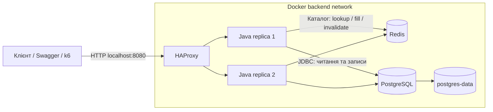

# High Load — система замовлень

Навчальний Java-проєкт для п'яти лабораторних: від проєктування REST API до горизонтального масштабування, розподіленого кешу та вимірювання продуктивності. Система керує покупцями, каталогом, залишками й замовленнями.

**Стек:** Java 21, Spring Boot 3.5.15, Spring JDBC, PostgreSQL 17.4, Flyway, Redis 7.4, HAProxy 3.0, k6, Maven Wrapper і Docker Compose.

## Швидкий запуск

Потрібні Docker Desktop із Linux containers і Docker Compose v2 з підтримкою `--wait`. Перший запуск потребує інтернету для завантаження образів і залежностей. Java та Maven на хості для контейнерного запуску не потрібні.

Із кореня репозиторію:

```powershell
docker compose up --build -d --wait --remove-orphans
```

Запускаються PostgreSQL, Redis, дві Java-репліки та HAProxy. Flyway автоматично створює структуру БД. `--remove-orphans` прибирає застарілі сервіси цього Compose project, зокрема `app2` із Lab 2. Дані зберігаються у томі `postgres-data`; ім'я проєкту `high-load-lab1` збережене для сумісності попередніх лабораторних.

| Адреса | Призначення |
|---|---|
| [Swagger UI](http://localhost:8080/swagger-ui/index.html) | Опис API та ручні запити |
| [Каталог](http://localhost:8080/api/products) | Сторінка товарів |
| [Health](http://localhost:8080/health) | Готовність backend і доступність БД |
| [OpenAPI](http://localhost:8080/v3/api-docs) | Машиночитна специфікація API |

```powershell
docker compose ps
docker compose logs -f app lb
.\scripts\demo.ps1
docker compose stop
docker compose start
```

`demo.ps1` створює демонстраційні дані та перевіряє бізнес-сценарій. Варіант `-VerifyPersistence` додатково перезапускає контейнер БД. Звичайна зупинка зберігає дані; `docker compose down -v` видаляє том БД разом із ними.

## Навігація

- [Архітектура та дані](#архітектура-та-дані)
- [Bottlenecks та обмеження](#bottlenecks-та-обмеження)
- [Лабораторні 1–5](#лабораторні-1–5)
- [API](#api)
- [Конфігурація](#конфігурація)
- [Тести та статус перевірок](#тести-та-статус-перевірок)
- [Структура проєкту](#структура-проєкту)

## Архітектура та дані



Backend — модульний моноліт із модулями `customer`, `catalog`, `order`. Контролери приймають HTTP-запити, сервіси виконують бізнес-правила, repositories працюють із SQL. Усі репліки використовують одну PostgreSQL і спільний Redis. На хості опубліковано тільки порт HAProxy; backend, БД і Redis доступні у внутрішній мережі.

Чотири таблиці описують предметну область:

| Таблиця | Дані та зв'язки |
|---|---|
| `customers` | Покупці з унікальним email; один покупець має багато замовлень |
| `products` | Каталог: артикул, назва, ціна, залишок, ознака активності |
| `orders` | Покупець, сума, статус `PLACED` або `CANCELLED` |
| `order_items` | Позиції замовлення: товар, кількість, історичні назва та ціна |

Оформлення й скасування виконуються транзакційно. `FOR UPDATE` узгоджує зміни залишків між репліками. Ціни для оформлення читаються з БД, сума розраховується сервером у гривнях. Повторне скасування не повертає товар удруге. Видалення товару логічне: він зникає з каталогу, історія замовлень зберігається.

## Bottlenecks та обмеження

Це потенційні обмеження архітектури. Конкретний bottleneck визначається вимірюваннями, а не лише наявністю компонента.

| Компонент / операція | Причина уповільнення | Що спостерігати |
|---|---|---|
| PostgreSQL | Усі репліки використовують спільні CPU, диск і транзакційний журнал БД | SQL latency, DB CPU/I/O, плато RPS |
| Пули з'єднань | До `N × DB_POOL_SIZE` з'єднань; очікування вільного connection | Hikari wait/timeouts, `pg_stat_activity` |
| Оформлення популярного товару | Конкуренція за рядки, заблоковані `FOR UPDATE` | Lock wait, `pg_locks`, p99 запису |
| Глибокі сторінки каталогу | `OFFSET` вимагає пропускати дедалі більше рядків | План SQL, час некешованих читань |
| Холодний кеш або відмова Redis | Одночасні MISS/BYPASS збільшують кількість SELECT | Cache hit rate, DB load, latency |
| HAProxy, мережа, спільний хост | Обмежені CPU та мережа; k6 також споживає ресурси | CPU контейнерів, connection rate, навантаження генератора |

Практичні межі реалізації:

- PostgreSQL і HAProxy запущені в одному екземплярі кожен; їхня відмовостійкість не реалізована.
- Health checks не виявляють відмову миттєво; активний запит при SIGKILL може обірватися. Уже відправлений POST балансувальник автоматично не повторює.
- Створення замовлення не має idempotency key: повтор після втрати відповіді може створити дублікат.
- Commit у PostgreSQL та інвалідація Redis не атомарні. При збої між ними можлива застаріла сторінка до завершення її TTL. Checkout завжди використовує БД.
- Кеш не має single-flight чи distributed lock на заповнення: конкурентні MISS можуть виконати повторні SELECT.
- Автентифікація й публічне production-розгортання не входять у цей прототип. HTTP прив'язаний до localhost; стандартний пароль БД призначений для локальної роботи.

## Лабораторні 1–5

| № | Тема | Результат | Деталі |
|---|---|---|---|
| 1 | System Design | Доменна модель, REST API, транзакції, PostgreSQL, міграції та Docker | [Лаби 1–2](docs/labs1-2.md) |
| 2 | Stateless Architecture | Взаємозамінні backend-процеси, спільний стан, `X-Instance-ID`, сценарії втрати вузла | [Аудит стану та перевірки](docs/labs1-2.md) |
| 3 | Horizontal Scaling | HAProxy, Round Robin / Least Connections, health checks, 1/2/3 репліки | [Масштабування](docs/horizontal-scaling.md) |
| 4 | Distributed Caching | Redis Cache-Aside, TTL, інвалідація після commit, fallback до БД | [Кешування](docs/distributed-caching.md) |
| 5 | Performance Baseline | Три k6-сценарії, прогрів, ступені навантаження, метрики, CSV/HTML-звіт | [Методика вимірювань](docs/performance-baseline.md) |

### Lab 1 — базовий прототип

Основна логіка міститься у `CustomerService`, `ProductService`, `OrderService` та відповідних repositories. Схема БД — [Flyway-міграція](src/main/resources/db/migration/V1__create_order_schema.sql), приклади запитів — [api.http](docs/api.http).

```powershell
.\scripts\demo.ps1
# Окремо: перевірка збереження даних із перезапуском БД
.\scripts\demo.ps1 -VerifyPersistence
```

### Lab 2 — взаємозамінність backend

Бізнес-стан зберігається у PostgreSQL; локальні змінні потрібні лише під час обробки запиту. `InstanceIdFilter` додає мітку репліки. `StatelessClusterIT` містить перевірки двох JVM, конкурентного оформлення та відкату при падінні до commit.

Історичні `demo-stateless.ps1` і [stateless.http](docs/stateless.http) використовують прямі порти 8080/8081 та сервіси `app`/`app2` із версії Lab 2. Вони не є інструкцією запуску поточного стека з HAProxy. Для поточної версії використовуйте єдиний порт і сценарії Lab 3.

### Lab 3 — балансування і масштабування

[HAProxy](infra/haproxy.cfg) знаходить репліки через Docker DNS; конфігурація має 10 серверних слотів. `/health` перевіряє БД через `SELECT 1`. Дві невдалі перевірки вилучають вузол із пулу, дві успішні повертають його.

```powershell
docker compose up -d --wait --no-deps --scale app=3 app
```

Порівняння алгоритмів, штучна затримка, прогони 1/2/3 реплік і зупинка вузла описані в [інструкції Lab 3](docs/horizontal-scaling.md). Для цих експериментів у поточній версії потрібно вимкнути кеш і явно ввімкнути профіль `lab3`; команди наведені там.

### Lab 4 — спільний кеш каталогу

Кешується `GET /api/products?page=...&size=...`. Заголовок `X-Cache` показує `HIT`, `MISS` або `BYPASS`. Типовий TTL — 30 секунд. Зміни каталогу й залишків перемикають покоління ключів після commit. Redis недоступний — читання виконується через БД.

```powershell
.\scripts\demo-cache.ps1
# Додатково: зупинка Redis, перевірка fallback та відновлення
.\scripts\demo-cache.ps1 -SimulateFailure
```

Виконуйте демонстрацію без паралельного навантаження: вона перевіряє послідовність MISS → HIT → зміна → MISS → HIT. Формат ключів, гарантії, налаштування й вимірювання — у [Lab 4](docs/distributed-caching.md).

### Lab 5 — вимірювання продуктивності

Runner створює окремий Compose project із власною тестовою БД та Redis; типовий порт — 18080. Сценарії: читання каталогу, створення замовлення, повний цикл із перевіркою та скасуванням. Рівні — 10/25/50/100/200 VUs, прогрів відділений від вимірювань.

```powershell
.\scripts\run-baseline.ps1 -Scenario read -Instances 1 -CacheMode disabled
.\scripts\run-baseline.ps1 -Scenario write -Instances 1
.\scripts\run-baseline.ps1 -Scenario workflow -Instances 1
Start-Process .\results\baseline.html
```

У `results/` зберігаються RPS, avg/p50/p95/p99, errors, ресурсні й DB counters, CSV та HTML із графіками. Для порівняння реплік, cold/warm cache і визначення межі навантаження дивіться [Lab 5](docs/performance-baseline.md). Фактичні значення мають бути отримані прогоном.

## API

| Метод | Endpoint | Дія |
|---|---|---|
| POST | `/api/customers` | Створити покупця |
| GET | `/api/customers/{id}` | Прочитати покупця |
| POST | `/api/products` | Створити товар |
| GET | `/api/products` | Каталог із `page` та `size` |
| GET | `/api/products/{id}` | Прочитати товар |
| PUT | `/api/products/{id}` | Оновити товар |
| POST | `/api/products/{id}/restock` | Поповнити залишок |
| DELETE | `/api/products/{id}` | Прибрати товар із продажу |
| POST | `/api/orders` | Оформити замовлення |
| GET | `/api/orders/{id}` | Прочитати замовлення |
| GET | `/api/orders?customerId=...` | Історія покупця з пагінацією |
| POST | `/api/orders/{id}/cancel` | Скасувати замовлення |

Форми запитів доступні у Swagger та [api.http](docs/api.http). Некоректні дані дають `400`, відсутній ресурс — `404`, конфлікт або нестача залишку — `409`, недоступність БД — `503`. Помилки мають структурований формат `ProblemDetail`.

## Конфігурація

Compose читає `.env` і змінні середовища. Для стандартного запуску `.env` не обов'язковий; зміну конфігурації контейнерів застосовуйте через `docker compose up -d` із потрібними параметрами відтворення.

| Змінна | Типове значення у Compose | Призначення |
|---|---|---|
| `APP_PORT` | `8080` | Порт HAProxy на хості |
| `DB_PASSWORD` | `lab1-local-password` | Пароль локальної PostgreSQL |
| `DB_POOL_SIZE` | `10` | Максимум з'єднань на Java-репліку |
| `CACHE_ENABLED` | `true` | Увімкнення Redis-кешу |
| `CACHE_TTL_SECONDS` | `30` | TTL сторінки, 1–3600 секунд |
| `LB_ALGORITHM` | `roundrobin` | `roundrobin` або `leastconn` |
| `SPRING_PROFILES_ACTIVE` | `default` | `lab3` вмикає навчальний фільтр затримки |

Поза Compose Java читає `DB_URL`, `DB_USERNAME`, `DB_PASSWORD`, `PORT`, `REDIS_HOST` із середовища; кеш типово вимкнений. Spring Boot самостійно не завантажує `.env`. Деталі локального запуску є в архівній документації Labs 1–2; назви сервісів у старих командах потрібно звіряти з поточною конфігурацією.

Усі репліки повинні мати однаковий режим кешу. Після записів із вимкненим кешем перед його поверненням дочекайтеся TTL або перезапустіть Redis, щоб прибрати старі сторінки. Повернення після експериментів Lab 3:

```powershell
$env:CACHE_ENABLED = 'true'
$env:SPRING_PROFILES_ACTIVE = 'default'
$env:LB_ALGORITHM = 'roundrobin'
docker compose restart redis
docker compose up -d --wait --scale app=2
```

Redis у цій конфігурації не зберігає кеш на диску; його перезапуск очищає кеш, але не бізнес-дані PostgreSQL.

## Тести та статус перевірок

Для Java-перевірок на хості потрібні JDK 21 і Docker для інтеграційних тестів:

```powershell
.\mvnw.cmd test
.\mvnw.cmd verify
```

`OrderApiIT` перевіряє API, транзакції та конкуренцію; `StatelessClusterIT` — дві JVM і збої; `CatalogCacheTest` — кеш та інвалідацію. Інтеграційні тести використовують окрему тимчасову БД. Ці тести не замінюють експерименти HAProxy/k6.

Для початкової версії Lab 1 зафіксовано 14 успішних тестів і демонстрацію persistence. Перевірки змін Labs 2–5 та вимірювання продуктивності ще не виконані. Історичний результат Lab 1 не є підтвердженням працездатності поточної версії.

## Структура проєкту

```text
src/main/java/ua/edu/highload/
  customer/              Покупці
  catalog/               Каталог, залишки, Redis-кеш
  order/                 Оформлення та скасування замовлень
  common/                Помилки API, health, фільтри, пагінація
src/main/resources/
  application.yaml       Налаштування Spring
  db/migration/          Flyway SQL
src/test/                Unit та інтеграційні тести
infra/haproxy.cfg        Балансування і health checks
load-tests/              k6-сценарії та baseline fixtures
scripts/                 Демонстрації, runner і генератор звіту
docs/                    Детальні інструкції лабораторних та HTTP-приклади
results/                 Локальні результати вимірювань, ігноруються Git
compose.yaml             Основний стек
compose.baseline.yaml    Ліміти ресурсів і генератор baseline
compose.dev.yaml         Доступ до БД з IDE
Dockerfile               Збірка та запуск Java-образу
```
