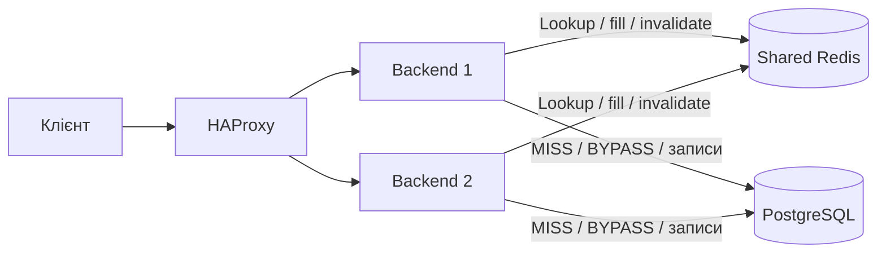

# Лабораторна №4 — розподілене кешування

До масштабованого Java API додано спільний Redis і Cache-Aside для `GET /api/products?page=...&size=...`. Бізнес-дані залишаються в PostgreSQL. Redis доступний усім backend-реплікам через внутрішню Docker network, без порту на хості.

**Перевірки цієї лабораторної ще не виконані.** Числа продуктивності потрібно отримати самостійно.

## Запуск і демонстрація кешу

```powershell
docker compose up --build -d --wait --remove-orphans
.\scripts\demo-cache.ps1
# Додатково: зупинити Redis, перевірити читання та запис через БД, відновити Redis
.\scripts\demo-cache.ps1 -SimulateFailure
```

Swagger: <http://localhost:8080/swagger-ui/index.html>. Виконуйте demo без паралельного навантаження: скрипт очікує точну послідовність MISS → HIT → PUT → MISS → HIT. Він створює новий товар, перевіряє свіжу ціну, показує `X-Instance-ID`, `X-Cache` і час кожного GET. З `-SimulateFailure` також змінює ціну при вимкненому Redis та перевіряє її через BYPASS; Redis запускається знову в `finally`. Демонстраційний товар залишається в БД.

## Що кешується і чому

Каталог — read-intensive сценарій: багато користувачів можуть читати ті самі сторінки, тоді як набір товарів змінюється рідше. Кеш зменшує кількість SELECT каталогу й повторну підготовку відповіді. Виграш для маленької локальної БД не гарантований: Redis і JSON-серіалізація теж мають вартість.

| Параметр | Значення |
|---|---|
| Endpoint | `GET /api/products`, усі валідні комбінації page/size |
| Ключ сторінки | `orders:catalog:v1:{epoch}:page:{page}:size:{size}` |
| Ключ поточного покоління | `orders:catalog:v1:epoch` |
| TTL сторінки | 30 секунд, `CACHE_TTL_SECONDS`, дозволено 1–3600 |
| Eviction | Redis `allkeys-lru`, ліміт 128 MB |
| Джерело істини | PostgreSQL |
| Вимкнення кешу | `CACHE_ENABLED=false` |

`v1` версіонує формат, epoch — випадковий UUID, а page/size повністю описують параметри поточного endpoint. Порядок сортування фіксований у SQL. При додаванні фільтрів, валют, локалі або персоналізації вони також повинні увійти до ключа. Індивідуальний GET товару та всі операції запису працюють із БД без кешу.

**HIT:** з Redis читається namespace і готова сторінка, SELECT каталогу не виконується. **MISS:** сторінка читається з PostgreSQL і записується в Redis із TTL. **BYPASS:** кеш вимкнений, недоступний або його запис/десеріалізація не вдалися — відповідь формується з БД. Значення передається заголовком `X-Cache`.

## Інвалідація та узгодженість

Створення, PUT, поповнення, видалення товару, checkout і скасування замовлення змінюють каталог або залишки. `ProductRepository` планує інвалідацію для всіх цих шляхів. У транзакції виконується одна інвалідація **після commit**, при rollback — жодної. Для автокомітної операції — після успішного SQL.

Інвалідація встановлює новий UUID у ключ epoch. Наступний GET використовує новий namespace і повертає MISS зі свіжими даними. Усі сторінки старого покоління стають недоступними й видаляються за TTL; немає дорогого `KEYS *` або сканування всього Redis. Якщо старий паралельний MISS завершиться після інвалідації, він запише сторінку у старий namespace, не перезаписуючи нові дані.

Це гарантує свіже послідовне читання після успішної інвалідації за доступного Redis. **Між commit PostgreSQL та оновленням Redis немає спільної транзакції.** Якщо вузол впаде в цьому проміжку або інвалідація не дійде до Redis через мережевий збій, інший вузол може прочитати стару сторінку до її expiration. Помилка інвалідації логується; підтверджений запис у БД не скасовується. TTL обмежує життя запису, але сам по собі не дає строгої консистентності. Для суворішої гарантії за таких збоїв потрібен окремий протокол узгодження/доставки інвалідацій і контроль версій.

Кеш не використовується для перевірки наявності товару чи обчислення ціни checkout: ці рішення завжди приймаються транзакційно в PostgreSQL. Застаріла вітрина не дозволяє продати відсутній товар.

## Fallback та відновлення

Redis — необов'язкова залежність backend: його немає в `depends_on` застосунку, а Redis health indicator виключено з загального Actuator health. `/health` і маршрутизація HAProxy залежать від PostgreSQL. При помилці Redis читання переходить у BYPASS; connect/command timeout — 200 мс. Cache SET failure не спричиняє повторного SELECT.

Redis налаштований без persistence. Після `docker compose stop redis` / `start redis` його кеш порожній, нові запити прогріють його з БД. Це властивість саме цієї конфігурації; короткий мережевий збій без рестарту не очищає пам'ять Redis. Fallback зберігає функціональність, але може різко збільшити навантаження на PostgreSQL.



## Вимірювання та перевірки

Запишіть показані скриптом elapsed ms; це одиничні HTTP-вимірювання з клієнтськими накладними витратами, не навантажувальний baseline. Повторіть кілька разів при однакових даних і порівнюйте однакові page/size.

| Режим | X-Cache | Час відповіді, мс |
|---|---|---|
| Перший GET після зміни | MISS | ще не виміряно |
| Повторний GET | HIT | ще не виміряно |
| Redis зупинений | BYPASS | ще не виміряно |

Логи інвалідацій: `docker compose logs app`. Для HIT/MISS діагностичних логів встановіть рівень DEBUG для `ua.edu.highload.catalog.CatalogCache`; у звичайному режимі достатньо заголовків. Backend може повернути HIT на іншому `X-Instance-ID`, бо кеш спільний.

Для uncached-порівняння в наступній лабораторній:

```powershell
$env:CACHE_ENABLED = 'false'
docker compose up -d --no-deps --force-recreate --wait app
# Повернути кеш
$env:CACHE_ENABLED = 'true'
docker compose up -d --no-deps --force-recreate --wait app
```

Після записів у режимі CACHE_ENABLED=false дочекайтеся повного TTL перед поверненням кешу або перезапустіть Redis, щоб не використати сторінки попереднього запуску. Усі репліки повинні мати однакове налаштування кешу. Для запуску Java з IDE кеш типово вимкнений; Compose явно вмикає його і задає `REDIS_HOST=redis`.

Додані unit-тести `CatalogCacheTest`: MISS→HIT без повторного SQL, fallback, одиничний SELECT при помилці SET, інвалідація після commit та її відсутність після rollback. Команди: `.\mvnw.cmd test` або `.\mvnw.cmd verify` (повний набір потребує Docker). Тести не запускалися.

До теоретичного захисту: expiration — завершення TTL; invalidation — примусове припинення використання даних після зміни. LRU витісняє давно не використані ключі, LFU — рідко використовувані. Cache stampede — конкурентні MISS одного ключа, avalanche — масове одночасне закінчення кешу/відмова Redis. Цей MVP не має single-flight чи distributed lock для заповнення; можливі повторні SELECT. Напрями покращення — jitter TTL, обмеження конкурентного заповнення та контроль навантаження на БД.


